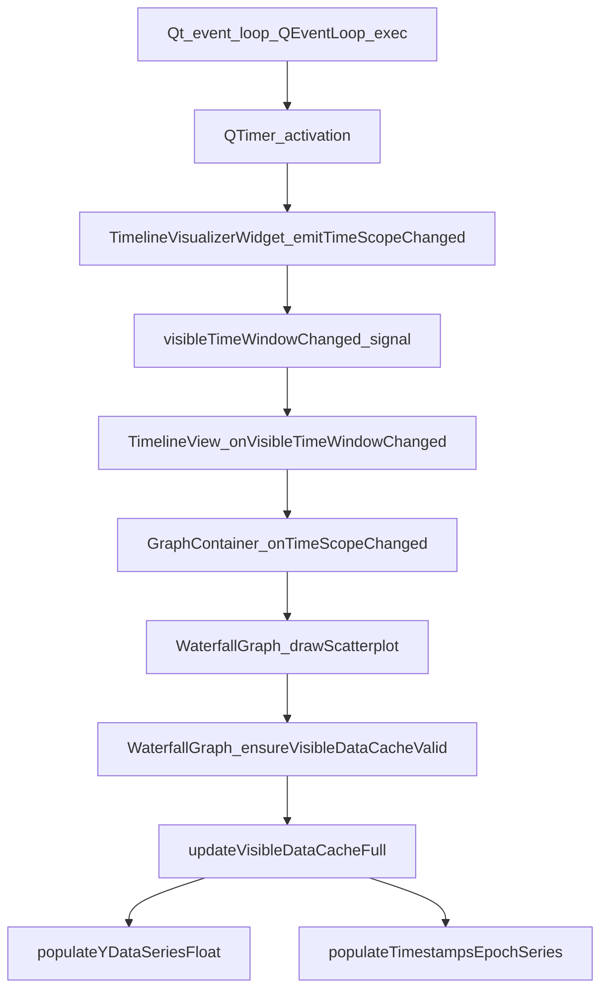

# Plan: Address Callgrind Hotspots (callgrind.out.31545)

## Metadata

| Field                | Value                                                                                      |
| -------------------- | ------------------------------------------------------------------------------------------ |
| **Profile file**     | [callgrind.out.31545](callgrind.out.31545)                                                 |
| **Binary**           | `./ui-sandbox` (PID 31545, callgrind-3.22.0)                                               |
| **Metric**           | Ir (retired instructions)                                                                  |
| **Total Ir**         | 4,109,337,107,506 (~4.11e12)                                                               |
| **Related analysis** | [callgrind_analysis_100293.md](callgrind_analysis_100293.md) (older run; different totals) |

**Important:** Ir counts are not wall-clock time. Re-run callgrind with the **same user scenario** after changes for comparable before/after numbers.

---

## Executive summary

The profile shows almost all work inside the Qt event loop, driven by **time-scope updates** that propagate through signals into **WaterfallGraph**: cache validation, **drawScatterplot**, and **full-series data extraction** (`populateYDataSeriesFloat` / `populateTimestampsEpochSeries`) into reusable `std::vector`s, then filtering into `CircularBuffer` caches.

Two layers of optimization apply:

1. **Reduce cost per run (data movement)** — highest impact: avoid full-series copies, remove redundant copies, `reserve(visibleCount)`.
2. **Reduce how often** expensive paths run (coalesce/throttle `emitTimeScopeChanged`, tighten cache invalidation) — **after** the data path is fixed.

---

## Problem statement and target pipeline

**Key insight:** This is **not primarily a rendering bottleneck**; it is a **data movement** problem. Callgrind shows heavy `std::vector::push_back` (~~14% combined for float + epoch vectors), placement new (~~4%+), and repeated reads from `CircularBuffer` while **materializing full series** into temporary vectors.

### Current pipeline (inefficient)

Data already lives in `CircularBuffer` in [waterfalldata.h](waterfalldata.h) (`dataSeriesYData`, `dataSeriesTimestampsEpoch`). The hot path still does:

1. `populateYDataSeriesFloat` / `populateTimestampsEpochSeries` — **copy the entire dataset** into `std::vector` ([waterfalldata.cpp](waterfalldata.cpp) ~646–689).
2. `std::lower_bound` / `std::upper_bound` on those vectors — find visible index range.
3. Copy **only the visible slice** into `m_cachedVisibleData` (`CircularBuffer<std::pair<float,qint64>>`).
4. Sometimes `**getVisibleDataVector**` copies **again** from cache into another `std::vector` for draw ([waterfallgraph.cpp](waterfallgraph.cpp) ~1594–1603).

Net effect: **CircularBuffer → full vector copy → slice → copy again → draw.**

### Target pipeline

**CircularBuffer → find visible range on epoch indices → copy only `[firstIdx, lastIdx)` → draw** (iterate cache directly; no extra `std::vector` unless an API truly requires it).

### Why binary search does not require a full `std::vector`

`CircularBuffer::operator[]` uses **logical indices**: `**0` = oldest, `size-1` = newest** ([circularbuffer.h](circularbuffer.h) ~142–143). Ingest is chronological, so `**dataSeriesTimestampsEpoch[series][i]` is non-decreasing in `i**`. You can implement `**lower_bound` / `upper_bound` on indices** (or a custom index binary search) by reading **only** `epoch[i]` from the existing `CircularBuffer<qint64>` — no need to materialize `std::vector<qint64>` for the full series. Then copy **Y** values for the same index range only (parallel buffers).

### Explicit implementation priority

| Priority | What                                                                                                                                                                                                 | Maps to    |
| -------- | ---------------------------------------------------------------------------------------------------------------------------------------------------------------------------------------------------- | ---------- |
| **1**    | Do **not** populate full vectors for the hot cache/draw path; binary-search **visible range on `CircularBuffer` epoch**, copy **only** `[firstIdx, lastIdx)` into the visible cache (or equivalent). | Phase 3    |
| **2**    | Remove redundant copies — **eliminate or bypass `getVisibleDataVector()**`; draw from `m_cachedVisibleData` / `CircularBuffer` directly.                                                             | Phase 4    |
| **3**    | **Preallocate**: `reserve(visibleCount)` (visible slice length, **not** `buffer.size()`) before any remaining vector fills.                                                                          | Phase 3–4  |
| **4**    | **Only after the above**: throttle/dedupe `emitTimeScopeChanged()`, reduce unnecessary cache invalidation.                                                                                           | Phases 1–2 |
| **5**    | Smaller wins: `mapDataToScreen`, epoch helpers, optional graphics polish.                                                                                                                            | Phases 5–7 |

---

## Call graph (inclusive picture)

High inclusive cost (percentages can exceed 100% because each ancestor includes the same callees):

**Primary files**

- [timelineview.cpp](timelineview.cpp) — `TimelineVisualizerWidget::emitTimeScopeChanged()` (e.g. ~1225–1247, and call sites ~369, ~426, ~1310, ~1402, ~1446).
- [graphcontainer.cpp](graphcontainer.cpp) — `GraphContainer::onTimeScopeChanged` and downstream emits.
- [waterfallgraph.cpp](waterfallgraph.cpp) — `ensureVisibleDataCacheValid` (~~1568), `updateVisibleDataCacheFull` (~~1668), `updateVisibleDataCacheIncremental` (~~1732), `drawScatterplot` (~~4241), `getVisibleDataVector` (~1594).
- [waterfalldata.cpp](waterfalldata.cpp) — `populateYDataSeriesFloat`, `populateTimestampsEpochSeries` (~646+).

---

## Self-cost hotspots (project-filtered annotation)

These are the main **attributed** instruction sinks in your tree (approximate; use fresh `callgrind_annotate --include=<repo>` after changes):

| Area                                           | Approx. share | Notes                                               |
| ---------------------------------------------- | ------------- | --------------------------------------------------- |
| `std::vector<float>::push_back`                | ~7.3%         | Building large temporaries along scatter/cache path |
| `std::vector<long long/qint64>::push_back`     | ~7.3%         | Epoch/timestamp side                                |
| `CircularBuffer<...>::operator[]`              | ~4.5% / ~4.4% | Reads while populating or iterating                 |
| `WaterfallData::populateTimestampsEpochSeries` | ~4.4%         | Full-series copy into vector                        |
| `WaterfallData::populateYDataSeriesFloat`      | ~4.4%         | Full-series copy into vector                        |
| Placement `new` / vector growth                | ~4.3%         | Reallocations when capacity insufficient            |
| `WaterfallGraph::mapDataToScreen`              | ~2.8%         | Per-point mapping                                   |
| `QDateTime` comparisons / helpers              | ~2.4%+        | Prefer epoch in inner loops                         |
| `WaterfallData::getCombinedTimeRange`          | ~1.0%         | Cache if called redundantly                         |

**Key insight:** `updateVisibleDataCacheFull` already uses **epoch `lower_bound` / `upper_bound**` after filling **full** vectors ([waterfallgraph.cpp](waterfallgraph.cpp) ~1692–1716). The waste is **copying the entire series** before slicing the visible range — the search should run on **epoch in `CircularBuffer**`, not on two full temporary vectors.

---

## Phase 1 — Scope signal frequency and coalescing

**Run after Phases 3–4** unless a quick win is needed — see [Implementation order (recommended)](#implementation-order-recommended). Implements **priority 4** for signal-side reduction.

### Problem

Inclusive cost clusters on `emitTimeScopeChanged` → `visibleTimeWindowChanged` → container/graph layout → waterfall redraw. Redundant emissions multiply the whole downstream chain.

### Actions

1. **Inventory** every `emitTimeScopeChanged()` / `emit visibleTimeWindowChanged` path in [timelineview.cpp](timelineview.cpp) and any other translation units.
2. **Dedupe by value**: compare new `TimeSelectionSpan` to last emitted (epoch ms or `QDateTime` with tolerance). Skip emit if unchanged.
3. **Throttle** high-frequency sources (timer ticks, animation): cap to N Hz or merge pending updates into one deferred emit (single-shot timer or `QMetaObject::invokeMethod` with `QueuedConnection` coalescing pattern).
4. **Drag behavior**: during slider drag you already emit on move (~1310); consider **throttling** emits during drag and **one final emit** on release if the UI allows (validate UX).

### Success criteria

- Fewer `GraphContainer::onTimeScopeChanged` / `WaterfallGraph::drawScatterplot` invocations per second for the same interaction (measure with logs or counters).

### Risks

- Skipping emits can leave graphs stale if equality checks are wrong; **epsilon** for float/time must match domain (e.g. 1 ms vs 1 s).

---

## Phase 2 — Cache validity and invalidation

**Run after Phases 3–4** for the same reason as Phase 1 — see [Implementation order (recommended)](#implementation-order-recommended). Implements **priority 4** for fewer unnecessary full cache rebuilds.

### Problem

`ensureVisibleDataCacheValid` calls `updateVisibleDataCacheFull` when `isVisibleDataCacheValid` is false. Over-invalidating forces expensive full repopulates.

### Actions

1. Trace **all** branches of `isVisibleDataCacheValid` in [waterfallgraph.cpp](waterfallgraph.cpp) / [waterfallgraph.h](waterfallgraph.h) (and any invalidation helpers).
2. Align invalidation with **visible epoch window** (`m_cachedTimeMinEpoch` / `m_cachedTimeMaxEpoch`) already used in `updateVisibleDataCacheFull` so that **non-changing** mapped bounds do not invalidate unnecessarily.
3. Prefer **updateVisibleDataCacheIncremental** when the visible epoch range is unchanged and only **tail data** grew (existing incremental path ~1732+).

### Success criteria

- Higher ratio of incremental vs full cache updates during live streaming (instrument counters).

---

## Phase 3 — Window-only population (highest impact per-run win)

This phase implements **priority 1** in [Explicit implementation priority](#explicit-implementation-priority): stop the **CircularBuffer → full vector → slice** pattern.

### Problem

`updateVisibleDataCacheFull` and incremental path currently call:

- `dataSource->populateYDataSeriesFloat(seriesLabel, m_reusableYDataFloat)`
- `dataSource->populateTimestampsEpochSeries(seriesLabel, m_reusableTimestampsEpoch)`

That typically **fills the entire series** into vectors, then **binary-searches** and copies only the visible slice into `m_cachedVisibleData`. Instruction cost is dominated by **full-series push_back** and `CircularBuffer` reads.

### Actions

1. **Design API** on `WaterfallData` (or `WaterfallGraph` + direct buffer access) to obtain **only index range** `[firstIdx, lastIdx)` for the current visible epoch window **without** copying the whole series. Options:
  - **Index binary search** on `dataSeriesTimestampsEpoch` using `CircularBuffer<qint64>::operator[]` (logical order is chronological — see [Why binary search does not require a full `std::vector](#why-binary-search-does-not-require-a-full-stdvector)`).
  - **New methods** e.g. `populateYDataSeriesFloatRange(seriesLabel, out, firstIdx, count)` or `appendVisibleWindow(seriesLabel, cache, timeMinEpoch, timeMaxEpoch)` that writes **directly** into `CircularBuffer<std::pair<float,qint64>>` or a pre-reserved buffer.
2. `**reserve()**` `m_reusableYDataFloat` and `m_reusableTimestampsEpoch` using **visible count** `(lastIdx - firstIdx)` when a vector path remains (**priority 3** — only reserve full `buffer.size()` if something still needs a full copy).
3. Keep **full populate** only for **export**, **tests**, or code paths that truly need all points.

### Files

- [waterfalldata.h](waterfalldata.h) / [waterfalldata.cpp](waterfalldata.cpp) — new range/window population APIs.
- [waterfallgraph.cpp](waterfallgraph.cpp) — switch `updateVisibleDataCacheFull` / incremental to use them.

### Success criteria

- Large drop in Ir for `populateYDataSeriesFloat`, `populateTimestampsEpochSeries`, and `std::vector::push_back` in the next callgrind run.

---

## Phase 4 — Remove redundant copies in draw (`getVisibleDataVector`)

Implements **priority 2** in [Explicit implementation priority](#explicit-implementation-priority).

### Problem

`getVisibleDataVector` (approximately lines 1594–1603 in [waterfallgraph.cpp](waterfallgraph.cpp)) **clears** `m_reusableVisibleData` and **push_backs** every element from `m_cachedVisibleData[seriesLabel]`, duplicating work for scatter.

### Actions

1. Refactor **drawScatterplot** (and any caller that only needs iteration) to iterate `**m_cachedVisibleData[seriesLabel]**` (or a **const reference** to the `CircularBuffer`) **without** building `m_reusableVisibleData`.
2. If a contiguous `std::vector` is still required for an API, use **resize + indexed fill** or **one reserve + assign** instead of repeated `push_back` from buffer.

### Success criteria

- Lower Ir for `getVisibleDataVector`, `CircularBuffer::push_back` on the temp vector path, and `std::vector<std::pair<float,qint64>>::push_back`.

---

## Phase 5 — `mapDataToScreen` micro-optimization

### Problem

~2.8% self in `WaterfallGraph::mapDataToScreen` (per prior annotation).

### Actions

1. Confirm with **Callgrind/KCachegrind** whether cost is **per-call overhead** or **call count** (use per-call stats).
2. **Hoist invariants** out of inner loops: axis min/max, widget width/height, precomputed scale factors for the current frame.
3. Evaluate **batching** (e.g. fewer `QPointF` temporaries, or building paths in bulk) without changing visual output.

---

## Phase 6 — Epoch-first time helpers

### Problem

`QDateTime::operator<`, `getCombinedTimeRange`, `getLatestTime` still appear in hot lists.

### Actions

1. Ensure **all** inner loops in hot draw/cache paths use **qint64 epoch ms** (already started in `updateVisibleDataCacheFull`).
2. **Cache** `getCombinedTimeRange()` / `getLatestTime()` results when **data revision** or **timestamp** has not changed (revision counter or monotonic `sequence` on `WaterfallData`).

---

## Phase 7 — Secondary UI / graphics (optional follow-up)

From inclusive tails (lower priority unless profile repeats):

| Item                                                         | Direction                                                                 |
| ------------------------------------------------------------ | ------------------------------------------------------------------------- |
| `QGraphicsTextItem::setPlainText` / `QGraphicsTextItem` ctor | Update text only when string changes; reuse items                         |
| `QGraphicsScene::clear`                                      | Prefer targeted item removal/update                                       |
| `BTWGraph::drawCustomCircleMarkers`                          | Reduce per-frame work or defer                                            |
| `mktime` / `qMkTime`                                         | Cache formatted labels; avoid repeated local-time conversion in hot paths |

---

## Phase 8 — Verification

1. Rebuild with **same CMake flags** and run **same manual scenario** as the original profile.
2. New capture: `callgrind.out.<pid>` and run:
  - `callgrind_annotate --auto=yes --include=/home/rolo/work/nstl/cpp_ui_lib <file>`
  - Compare total Ir and top symbols: `populate*`, `push_back`, `ensureVisibleDataCacheValid`, `drawScatterplot`, `mapDataToScreen`.
3. Optional: **frame timer** or scoped `QElapsedTimer` around scope handling vs draw for wall-clock confirmation.

---

## Implementation order (recommended)

Aligned with [Explicit implementation priority](#explicit-implementation-priority) (data movement first, signals/invalidation after):

1. **Phase 3** — Window-only population / index binary search on `CircularBuffer` epoch; `**reserve(visibleCount)**` for any temporary vectors.
2. **Phase 4** — Remove or bypass `**getVisibleDataVector**`; draw from cached visible buffer.
3. **Phase 1** — Throttle/dedupe `**emitTimeScopeChanged()**` (and related emits).
4. **Phase 2** — Tighten **cache invalidation** so full rebuilds are rarer.
5. **Phases 5–6** — `mapDataToScreen`, epoch-first helpers.
6. **Phase 7** as needed (graphics/text).
7. **Phase 8** — Re-profile with the same scenario (`callgrind.out.*`, `callgrind_annotate --include=...`).

---

## Open questions / decisions

- **Tolerance** for “same” `TimeSelectionSpan` (ms vs sample period).
- Whether **drag** should emit at full rate or throttled (UX vs performance).
- **API shape** for window-only reads (new `WaterfallData` methods vs iterator/range access to internal buffers with clear invariants).
- Confirm **monotonic time** in ingest; if clock adjustments or out-of-order points exist, index binary search assumptions may need a defined policy.

---

## References (code anchors)

| Location                                            | Role                                                        |
| --------------------------------------------------- | ----------------------------------------------------------- |
| [timelineview.cpp](timelineview.cpp) ~1225–1247     | `emitTimeScopeChanged`                                      |
| [waterfallgraph.cpp](waterfallgraph.cpp) ~1568–1583 | `ensureVisibleDataCacheValid`                               |
| [waterfallgraph.cpp](waterfallgraph.cpp) ~1594–1603 | `getVisibleDataVector`                                      |
| [waterfallgraph.cpp](waterfallgraph.cpp) ~1668–1722 | `updateVisibleDataCacheFull`                                |
| [waterfallgraph.cpp](waterfallgraph.cpp) ~1732–1773 | `updateVisibleDataCacheIncremental` (start)                 |
| [waterfalldata.cpp](waterfalldata.cpp) ~646+        | `populateYDataSeriesFloat`, `populateTimestampsEpochSeries` |
| [circularbuffer.h](circularbuffer.h) ~142–166       | Logical index order (oldest→newest) for index binary search |

---

## Extension: Data March 26th, 2026

This extension adds analysis from a later heavy profile run:

- **Profile file:** [callgrind.out.47407](callgrind.out.47407)
- **Date:** **March 26th, 2026**
- **Total Ir:** **6,312,466,656,664** (~6.31e12)
- **Observation:** significantly heavier than `callgrind.out.31545` (~4.11e12), indicating either longer runtime or more intense event/update activity.

### Extension findings (inclusive)

Dominant inclusive chains in `callgrind.out.47407`:

1. `Simulator::onTimerTick()` / `Simulator::addDataPoints()` (~54.3%)
2. `GraphLayout::addDataPointToDataSource(...)` (~54.3%)
3. `GraphContainer::onDataChanged(GraphType)` (~49.5%)
4. `TimelineVisualizerWidget::emitTimeScopeChanged(bool)` + `TimelineView::onVisibleTimeWindowChanged(...)` + `GraphContainer::onTimeScopeChanged(...)` (~41%)
5. `WaterfallGraph::drawScatterplot(...)` (~29.1%)
6. `GraphLayout::onContainerTimeScopeChanged(...)` + `GraphContainer::setTimeScope(...)` (~28.7%)
7. `WaterfallData::getCombinedTimeRange()` / `getLatestTime()` (~26.4% / ~17.3% inclusive)
8. `TimelineView::onTimerTick()` + `TimelineVisualizerWidget::setCurrentTime(...)` (~24.8%)

### Extension findings (project-filtered self cost)

Top attributed hotspots:

| Area                                                 | Approx. share | Notes                                      |
| ---------------------------------------------------- | ------------- | ------------------------------------------ |
| `QDateTime::operator<`                               | ~10.5%        | Timestamp comparisons remain expensive     |
| `CircularBuffer<QDateTime>::operator[]`              | ~8.24%        | High indexed access on datetime buffers    |
| `WaterfallGraph::mapDataToScreen(double, long long)` | ~6.55%        | Per-point mapping cost still large         |
| `std::vector<QDateTime>::operator[]`                 | ~5.49%        | Datetime vector indexing in hot path       |
| `WaterfallData::getCombinedTimeRange()`              | ~4.21%        | Repeated range queries                     |
| `WaterfallData::getLatestTime()`                     | ~3.01%        | Repeated latest-time lookups               |
| `WaterfallGraph::updateScatterplotItemsFull(...)`    | ~2.40%        | Scatter full update remains costly         |
| `WaterfallData::populateSeriesRangeFloatEpoch(...)`  | ~0.26%        | Range-based populate path is active (good) |

### What this changes in the plan

The original data-movement fix remains valid and should continue, but this run shows the next bottleneck has shifted toward **timestamp-heavy control/data loops** and **signal fan-out frequency**.

Updated emphasis:

1. Keep Phase 3/4 (window-only data path + remove redundant copies).
2. Move urgency of Phase 1/2 higher for simulator-driven workloads (scope dedupe/throttle + invalidation tightening).
3. Expand Phase 6 to aggressively replace hot-loop `QDateTime` comparisons/indexing with epoch (`qint64`) paths where feasible.
4. Add caching/versioning for `getCombinedTimeRange()` and `getLatestTime()` in fast paths.
5. Add metrics for event fan-out counts per tick in verification.

### Added verification checkpoints for this extension

In addition to existing Phase 8 checks, compare before/after:

- Calls per second to:
  - `GraphContainer::onDataChanged`
  - `GraphContainer::onTimeScopeChanged`
  - `TimelineVisualizerWidget::emitTimeScopeChanged`
- Ir share of:
  - `QDateTime::operator<`
  - `CircularBuffer<QDateTime>::operator[]`
  - `WaterfallData::getCombinedTimeRange`
  - `WaterfallData::getLatestTime`
  - `WaterfallGraph::updateScatterplotItemsFull`

Success condition for this extension: reduced signal/update fan-out and reduced datetime hot-loop cost without regressing visible behavior.