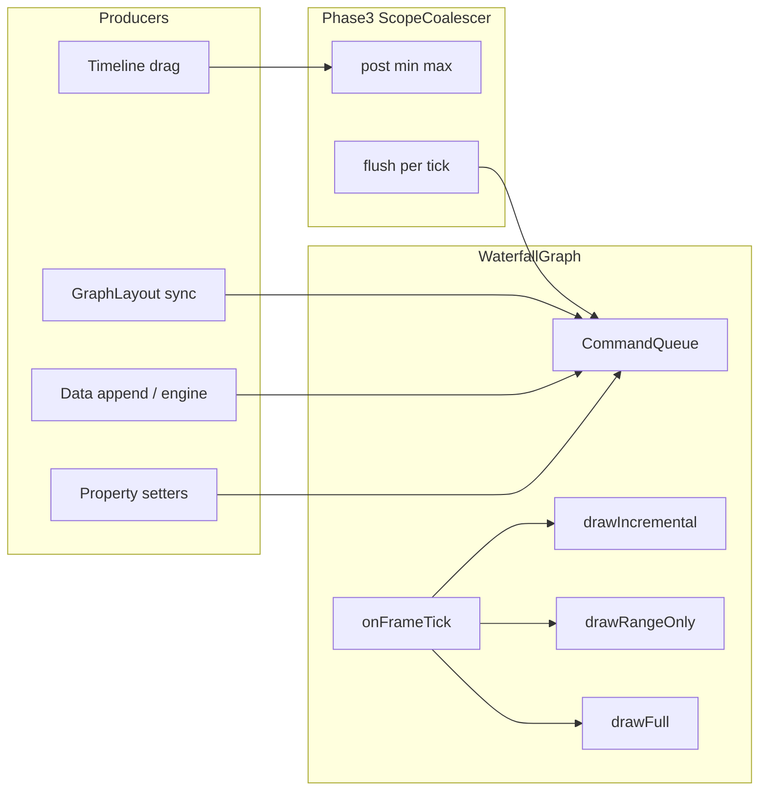

# WaterfallGraph render pipeline migration plan

## Current code anchors (for reviewers)

- Render state and flags live on [`waterfallgraph.h`](waterfallgraph.h): `RenderState`, `m_renderState`, `m_rangeUpdateNeeded`, `m_redrawPending`, `m_renderedTimeMin` / `m_renderedTimeMax`.
- [`waterfallgraph.cpp`](waterfallgraph.cpp) `draw()` only calls `drawIncremental()`; **`CLEAN` is a no-op** (early return). Some paths (e.g. `setData(series,…)`) call `draw()` without setting state first—worth preserving or fixing while mapping to commands so behavior does not regress.
- `setTimeRange()` **already** chooses `RANGE_UPDATE_ONLY` vs `FULL_REDRAW` using rendered extent ([`waterfallgraph.cpp`](waterfallgraph.cpp) ~5051–5097). Remaining pain is **synchronous** `setTimeRange` + `draw()` from [`graphcontainer.cpp`](graphcontainer.cpp) on every `TimeScopeChanged` during timeline drag (~1327–1331), and **N redraws** from property setters / `scheduleRedraw`.
- `GraphEngine` lambdas in `attachEngine()` call `markRangeUpdateNeeded()` + `drawIncremental()` ([`waterfallgraph.cpp`](waterfallgraph.cpp) ~408–425). **Do not edit `graphengine.cpp` / `graphengine.h`**; only change the `WaterfallGraph` side of these connections.
- Build is **C++11** today ([`ui-sandbox.pro`](ui-sandbox.pro)). `std::variant` requires **C++17** (`CONFIG += c++17`).

---

## 1) File list by phase

### Phase 1 — Command queue skeleton (no behavior change)

| File | Change |
|------|--------|
| [`ui-sandbox.pro`](ui-sandbox.pro) | Add `CONFIG += c++17`; add new source/header entries. |
| New `rendercommands.h` (or `waterfallgraph_render.h`) | `RenderPath` enum, `DataAppend` / `ScopeChange` / `StyleChange` / `ForceInvalidate`, `RenderCommand` variant, small `max(RenderPath)` helper, `overloaded` visitor helper. |
| [`waterfallgraph.h`](waterfallgraph.h) | Forward includes / member: `QQueue<RenderCommand>` (or `std::deque`), `postCommand()`, debug-only `QTimer* m_frameTickTimer`, `onFrameTickDebugPassthrough()` (name TBD). |
| [`waterfallgraph.cpp`](waterfallgraph.cpp) | Implement `postCommand()`: enqueue then **immediately** run today’s equivalent logic (delegate to existing `setRenderState` / `markSeriesDirty` / `drawIncremental()` / etc.) so queue is a no-op structurally. Debug: connect timer → drain queue with same immediate path. |

### Phase 2 — Scheduler replaces inline draw

| File | Change |
|------|--------|
| [`waterfallgraph.h`](waterfallgraph.h) / [`waterfallgraph.cpp`](waterfallgraph.cpp) | Enable frame timer for all builds; implement real `onFrameTick()` that drains queue, computes `RenderPath`, calls extracted `drawFull` / `drawRangeOnly` / `drawIncremental(dirtySeries)` (refactor of current `drawIncremental()` switch). `postCommand()` enqueues only (no immediate draw). Replace `scheduleRedraw` / `m_redrawPending` usage with posting `StyleChange` or `ForceInvalidate` as appropriate. **`forceFullRedraw()`** becomes `postCommand(ForceInvalidate{reason})` + ensure tick runs (or single-shot timer). **Log every full redraw with reason** (new overload or mandatory `QString` param with a documented default for legacy call sites). |
| [`waterfallgraph.cpp`](waterfallgraph.cpp) | All internal `draw()` / `drawIncremental()` entry points from setters (`setTimeInterval`, grid, line mode, `setCustomYRange`, etc.) route through commands. |
| [`graphcontainer.cpp`](graphcontainer.cpp) | Replace `m_currentWaterfallGraph->draw()` after scope/data paths with **thin** calls that post commands (either new public helpers on `WaterfallGraph` like `requestDrawFromScopeChange(...)` or existing setters that now only post). **No new `GraphContainer` public API.** |
| [`graphlayout.cpp`](graphlayout.cpp) | Any direct `graph->forceFullRedraw()` / redraw patterns should pass **reason strings** (internal calls only). |
| Subgraphs [`bdwgraph.cpp`](bdwgraph.cpp), [`brwgraph.cpp`](brwgraph.cpp), [`btwgraph.cpp`](btwgraph.cpp), [`fdwgraph.cpp`](fdwgraph.cpp), [`ftwgraph.cpp`](ftwgraph.cpp), [`ltwgraph.cpp`](ltwgraph.cpp), [`rtwgraph.cpp`](rtwgraph.cpp) | Overrides of `draw()` must **not** bypass the scheduler: either call base `WaterfallGraph::draw()` (if kept as “schedule only”) or call into protected `requestRedraw...` helpers. Audit recursive `draw()` calls inside BTW/RTW. |
| [`scwwindow.cpp`](scwwindow.cpp) / [`mainwindow.cpp`](mainwindow.cpp) (if they call `draw`/`forceFullRedraw`) | Align with scheduler entry points; add reasons for full redraws. |

### Phase 3 — Scope coalescer

| File | Change |
|------|--------|
| New `scopecoalescer.h` | `ScopeCoalescer` class as in your spec (`post` / `flush`). |
| [`graphcontainer.h`](graphcontainer.h) | **Private** member `ScopeCoalescer m_scopeCoalescer` (or `std::unique_ptr`), private method `flushScopeCoalescerToGraph()` — **no public API change**. |
| [`graphcontainer.cpp`](graphcontainer.cpp) | `onTimeScopeChanged(...)`: call `m_scopeCoalescer.post(min,max)` instead of immediate `setTimeRange`+`draw`; register one-shot or rely on graph frame tick to pick up flushed scope. **On drag release** (`fromFrozenUserDrag == true` or equivalent): `flush` immediately into graph command queue before returning. May require reading [`timelineview.cpp`](timelineview.cpp) emission semantics to place `flush` correctly. |
| [`waterfallgraph.cpp`](waterfallgraph.cpp) | Frame tick: if container-owned coalescer must run first, use a callback or friend-free pattern: e.g. `WaterfallGraph` exposes `setScopeFlushCallback(std::function<std::optional<ScopeChange>()>)` **without** touching public `GraphContainer` API (setter can be internal-only on `WaterfallGraph`). |

### Phase 4 — Rendered-extent tracking + RangeOnly routing

| File | Change |
|------|--------|
| [`waterfallgraph.h`](waterfallgraph.h) / [`waterfallgraph.cpp`](waterfallgraph.cpp) | Centralize `scopeWithinRenderedExtent` + **only** update `m_renderedMin`/`m_renderedMax` at end of **full** draw path; reset on `ForceInvalidate`. Remove ad-hoc invalidation of rendered extent scattered in `setTimeRange` / `setCustomYRange` where it duplicates scheduler policy (careful migration to avoid double promotion). |
| [`waterfallgraph.cpp`](waterfallgraph.cpp) | Remove `m_rangeUpdateNeeded` once `ScopeChange` + `RenderPath::RangeOnly` cover the same decisions (see open questions for Y-range-only). |

### Phase 5 — Shared cache store

| File | Change |
|------|--------|
| New `sharedcachestore.h` / `sharedcachestore.cpp` | `CacheKey`, `CachedData` (type TBD: likely wraps or moves the **shared** parts of today’s `m_cachedVisibleData` / epoch maps), `SharedCacheStore` with `get`/`put`/`invalidateEpoch`, LRU cap. |
| [`graphlayout.h`](graphlayout.h) | Private `SharedCacheStore m_sharedCache` (or pointer). **No public method signature changes** if graphs are wired via existing internal hooks. |
| [`graphlayout.cpp`](graphlayout.cpp) | After containers/graphs exist, call an **internal** wiring method (e.g. on `GraphContainer` / `WaterfallGraph`) to pass `&m_sharedCache`. |
| [`graphcontainer.cpp`](graphcontainer.cpp) | In `createAllWaterfallGraphs` / `setupWaterfallGraphProperties`, pass store pointer into each `WaterfallGraph`. |
| [`waterfallgraph.cpp`](waterfallgraph.cpp) | Read/write shared cache instead of per-graph duplicate projections; keep per-graph geometry/selection local. On data append: **single** epoch increment in store (GraphLayout or store owner) vs N× `invalidateAllVisibleDataCache`. |

---

## 2) New types (header location + owner)

| Type | Header | Owner |
|------|--------|--------|
| `enum class RenderPath { None, Incremental, RangeOnly, Full }` | `rendercommands.h` | WaterfallGraph module |
| `struct DataAppend`, `ScopeChange`, `StyleChange`, `ForceInvalidate` | `rendercommands.h` | WaterfallGraph module |
| `using RenderCommand = std::variant<...>` | `rendercommands.h` | WaterfallGraph module |
| `class ScopeCoalescer` | `scopecoalescer.h` | GraphContainer (private use) |
| `struct CacheKey`, `class SharedCacheStore`, `struct CachedData` (name finalized at impl) | `sharedcachestore.h` | GraphLayout (single instance) |

`RenderState` may remain **internal** during migration as implementation detail inside `drawFull` / `drawRangeOnly` / `drawIncremental`, or be folded into `RenderPath` over time—decide in Phase 2 to avoid two competing taxonomies.

---

## 3) Deleted / replaced members and methods

| Removed / replaced | Replacement |
|------------------|-------------|
| `bool m_redrawPending` | Frame tick + command queue (Phase 2). |
| `void scheduleRedraw()`, `void onScheduledRedraw()` | `postCommand(...)` + `onFrameTick()` (Phase 2). |
| `bool m_rangeUpdateNeeded`, `void markRangeUpdateNeeded()` | `ScopeChange` commands + scheduler merge logic; **or** a dedicated non-scope command if Y-only range updates remain (Phase 4 — see open questions). |
| Direct `m_renderState` writes outside scheduler | Only `onFrameTick` / command visitation sets render path; internal draw helpers consume path (Phases 2–4). |
| Scattered `invalidateAllVisibleDataCache()` on sync | Epoch `invalidateEpoch` on shared store (Phase 5). |
| Per-graph duplicated “projection” cache maps (partial) | Shared `SharedCacheStore` entries keyed by `CacheKey` (Phase 5). |

**Note:** [`waterfallgraph.h`](waterfallgraph.h) already declares `m_renderedTimeMin` / `m_renderedTimeMax`. Phase 4 aligns naming and update rules with your spec (`m_renderedMin`/`m_renderedMax` optional rename only if it reduces confusion).

---

## 4) Risk list and regression detection

| Phase | Risk | Detection |
|-------|------|-----------|
| 1 | C++17 / `variant` compile or platform issues | Clean build; run simulator single + multi panel. |
| 2 | **Frame latency**: updates lag up to ~16 ms | Visual check + log timestamp delta for critical paths; tune timer to `Qt::PreciseTimer` if needed. |
| 2 | Missed repaint if tick not started on graph construction | Assert `m_commandQueue` empty at shutdown; add debug counter “commands drained per second”. |
| 2 | `forceFullRedraw` without reason / silent full paths | Grep for `setRenderState(FULL_REDRAW)` outside scheduler; **CI grep** or `Q_ASSERT` in debug. |
| 3 | **Final scope wrong** after drag (coalescer drops last value) | Unit-style log test: last flush equals timeline’s final window; manual drag test. |
| 3 | Frozen / follow-mode interactions ([`graphcontainer.cpp`](graphcontainer.cpp) guards) | Replay existing scenarios; compare repaint count. |
| 4 | Wrong RangeOnly when Y scale or data extent changes | Scroll within extent vs pan outside; verify full redraw logged with reason. |
| 5 | Stale cache across panels after epoch bump | Multi-panel sync event → verify one invalidation; visual parity. |
| Subgraphs | BTW/RTW recursive `draw()` / symbol paths | Stress BTW symbol add; callgrind compare. |

**Metrics (constraint):** Run callgrind (or equivalent) **before Phase 1** and after each phase; record **full-redraw count** and **repaint/update count** for the same simulator scenario (single-panel and multi-panel). Attach numbers to each PR description.

---

## 5) Open questions (decide before coding)

1. **C++ standard:** OK to move [`ui-sandbox.pro`](ui-sandbox.pro) to **C++17** for `std::variant` / `std::visit`, or prefer Qt-only types (`QVariant` + enum discriminant) to stay on C++11?
2. **Y-range / `markRangeUpdateNeeded`:** Your variant has `ScopeChange` (time) and `StyleChange` (full). Today, small custom Y changes use `RANGE_UPDATE_ONLY` via `markRangeUpdateNeeded()` ([`waterfallgraph.cpp`](waterfallgraph.cpp) ~4071–4074). Do we add **`struct YRangeChange {}`** (maps to RangeOnly + internal range recompute), or treat all Y changes as `StyleChange` (full)?
3. **`DataAppend` vs engine signals:** `GraphEngine::dataAppended` currently does dirty + range + `drawIncremental`. Should `DataAppend` mean **incremental only** and a separate command handle combined Y/time range invalidation, or one command with flags?
4. **Timer ownership:** One `QTimer` per `WaterfallGraph` vs one per `GraphContainer` / `GraphLayout` driving all visible graphs? Per-graph matches your sketch; shared timer reduces timer overhead.
5. **Wiring `SharedCacheStore` without public API change:** Prefer **optional trailing constructor parameter with default** on `GraphContainer` / `WaterfallGraph`, or **`void setSharedCacheStore(SharedCacheStore*)`** called from `GraphLayout` after construction? Both keep MainWindow source stable if it uses existing constructors only.
6. **Public `WaterfallGraph::forceFullRedraw()`:** Add `QString reason` parameter (breaking for external callers) vs overload `forceFullRedraw(QString reason = QLatin1String("unspecified"))` and log—confirm acceptable for `scwwindow` / tests.

---

## Dependency sketch (post Phase 2+)

