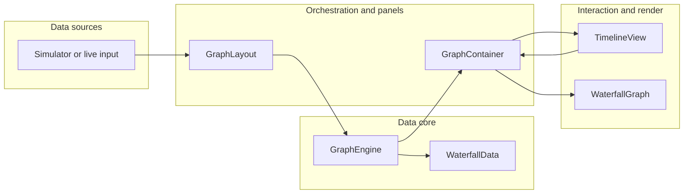

# Architecture and Implementation Methodology

**Purpose:** This document helps you reason about **system design and architecture decisions** in `cpp_ui_lib`. It summarizes the layered architecture, end-to-end data flow, and a repeatable methodology for where code should live, how changes should be validated, and what trade-offs the codebase already encodes.

**Related documentation (deeper detail):**

| Topic | Document |
|--------|----------|
| Layer breakdown, rendering state machine, features | [`syed_system.md`](./syed_system.md) |
| File-to-role map and mental model | [`PROJECT_COMPONENTS_BRIEF.md`](./PROJECT_COMPONENTS_BRIEF.md) |
| Memory pressure and module map | [`SYSTEM_MEMORY_ARCHITECTURE_REPORT_2026.md`](./SYSTEM_MEMORY_ARCHITECTURE_REPORT_2026.md) |
| Timeline/slider behavior | [`TIMELINEVIEW_SLIDER_ARCHITECTURE.md`](./TIMELINEVIEW_SLIDER_ARCHITECTURE.md) |
| SCW subsystem | [`scwwindow.md`](./scwwindow.md), [`scw-working-and-api.md`](./scw-working-and-api.md) |
| Callgrind-backed perf vs layers (`callgrind.out.213944`) | [`ARCHITECTURE_CALLGRIND_PROFILE_213944.md`](./ARCHITECTURE_CALLGRIND_PROFILE_213944.md) |
| Profiling observations for future redesigns (213944 + 39553) | [`observations-for-future-redesigns.md`](./observations-for-future-redesigns.md) |

---

## 1. Architectural stance

The application is a **Qt/C++ real-time visualization system**: multiple waterfall-style graphs, synchronized navigation, and interactive overlays. The design is intentionally **layered**:

- **Upper layers** coordinate layout, timers, and user intent (tabs, actions, multi-panel modes).
- **Middle layers** orchestrate containers, engines, and **cross-panel sync** (hub-and-spoke via shared state and Qt signals/slots).
- **Lower layers** hold **time-series data** (`WaterfallData`, circular buffers) and **rendering** (`WaterfallGraph` + `QGraphicsScene`/`QGraphicsView`).

**Implication for decisions:** Prefer **clear ownership** (one primary owner per object graph) and **downward dependencies** (UI depends on data abstractions; data does not depend on widgets). When that rule breaks, document the exception (for example, a callback or engine signal that intentionally reaches the view layer).

---

## 2. Layered architecture (concise)

### 2.1 Layers and responsibilities

| Layer | Primary types | Responsibility |
|--------|----------------|------------------|
| **Application** | `MainWindow`, `main.cpp` | App lifecycle, top-level UI shell, global timers, wiring optional flows (e.g. simulator). |
| **Orchestration** | `GraphLayout` | Multi-container layout modes; owns per–graph-type engines/data routing; propagates sync and scope. |
| **Panel** | `GraphContainer` | One visible graph panel: graph type selection, timeline, zoom, routing to the active `WaterfallGraph`. |
| **Interaction** | `TimelineView`, zoom/selection helpers | Visible time window, follow/frozen behavior, user-driven scope changes. |
| **Data** | `GraphEngine`, `WaterfallData`, `CircularBuffer` | Append paths, series storage, symbols/markers metadata, range queries. |
| **Visualization** | `WaterfallGraph`, specialized `*Graph` subclasses | Scene graph, incremental vs full redraw, visible caches, graph-type visuals. |
| **Secondary** | `SCWWindow`, `TacticalSolutionView`, etc. | Parallel workflows; integrate through explicit APIs rather than implicit globals. |

### 2.2 End-to-end data flow (runtime)

**Narrative:** Producers push samples → `GraphEngine` updates `WaterfallData` and notifies → `GraphLayout` / `GraphContainer` propagate scope and selection → `WaterfallGraph` updates caches and paints → `TimelineView` drives time-window changes that flow back through the container.

### 2.3 Synchronization model

Cross-container behavior (time interval, visible scope, cursor, follow/frozen, BTW markers, etc.) is centralized through **shared sync state** and **signal/slot propagation** rather than ad hoc polling. When you add a new synced concept, decide explicitly:

- **Is it per-container or global?** Global belongs in orchestration + shared state; per-container stays in `GraphContainer` unless all panels must mirror it.
- **Is the source of truth user gesture, timeline, or data clock?** The owner of that source should emit; others should react.

Details of specific sync dimensions are covered in [`syed_system.md`](./syed_system.md) and timeline docs.

### 2.4 Rendering model

Rendering favors **incremental updates** where possible: a render state machine distinguishes clean, range-only, incremental, and full redraw paths. **Full redraw wins** when required and is not silently downgraded. See [`syed_system.md`](./syed_system.md) (section on incremental rendering) for state transitions.

**Implication:** Performance work should first **preserve correctness of state transitions**, then reduce work inside incremental paths, then reduce frequency of full redraws.

---

## 3. Implementation methodology for design decisions

Use this as a **checklist** when proposing features, refactors, or performance changes.

### 3.1 Clarify the change type

| Change type | First questions |
|-------------|-----------------|
| **New data field or series** | Which `WaterfallData` series or metadata stream? Who appends and at what rate? Retention/capacity? |
| **New UI control** | Is it per-panel (`GraphContainer`) or app-wide (`MainWindow`)? Does it need sync across panels? |
| **New graph type or visual** | New subclass of `WaterfallGraph`? Shared base behavior vs duplicated drawing? |
| **Cross-panel behavior** | Does `GraphLayout` or shared sync state already have a pattern (signals, hub methods)? |
| **Performance** | Hot path: append, cache validation, scene updates, or paint? Measure before restructuring. |

### 3.2 Placement rules (where code should go)

1. **Data rules and invariants** → `WaterfallData` / `GraphEngine` (and buffers), not inside paint methods.
2. **“What is visible in time?”** → driven by timeline + scope APIs; avoid duplicating time math inside each graph if a shared helper already exists.
3. **Drawing policy** → `WaterfallGraph` (subclasses for type-specific visuals). Avoid reaching from data classes into `QGraphicsItem` details.
4. **Orchestration** → `GraphLayout` for anything that must apply to **all** containers or engines consistently.
5. **App shell** → `MainWindow` only for global menus, tabs, timers that are truly application-wide.

When unsure, default to **orchestration at `GraphLayout`**, not scattered slot wiring in `MainWindow`, unless the feature is strictly global UI.

### 3.3 Signals vs direct calls

- **Prefer signals/slots** for cross-layer notifications where multiple listeners may exist or where you want loose coupling (engine → container → graph).
- **Use direct calls** for hot inner loops where profiling shows signal overhead matters—but then keep boundaries narrow and document the coupling.

### 3.4 Memory and lifecycle (common architectural constraint)

The project has **retained-memory pressure** from multiple containers, multiple graph widgets, and per-view caches (see [`SYSTEM_MEMORY_ARCHITECTURE_REPORT_2026.md`](./SYSTEM_MEMORY_ARCHITECTURE_REPORT_2026.md)). For new design decisions:

- Prefer **explicit ownership** and **reuse** over allocating parallel caches without a retention policy.
- If you add large per-widget state, justify **N × panels × graph types** cost.
- Align **buffer capacity** with product requirements (history length), not unbounded growth.

### 3.5 Validation workflow (evidence-based changes)

1. **Functional:** Exercise the path with `Simulator` or the relevant UI flow; confirm one-panel vs multi-panel layouts.
2. **Performance:** Use callgrind/perf hotspots for CPU; heaptrack/valgrind for allocations and leaks when touching data paths or caches.
3. **Regression:** Compare behavior for follow/frozen, scope changes, and fast switching if your change touches timeline or layout.

Existing analyses under `user-docs/` and `.cursor/plans/` illustrate how bottlenecks were identified (for example, cache validation frequency, copy-heavy paths); treat those as templates for **before/after** reasoning.

### 3.6 Documentation expectations

When you make a **user-visible API** or **behavior contract** change, add or update the focused doc in `user-docs/` (pattern: `*_API.md` or subsystem guide). For **internal refactors** with no external API, a short note in the commit or a brief comment at the integration point is often enough.

---

## 4. System design trade-offs already in the codebase

Understanding these reduces thrashing when choosing approaches:

- **Throughput vs clarity:** Real-time append + rich visuals favor incremental rendering and caching; simplicity favors full redraws. The codebase leans **incremental** at the graph layer.
- **Single source of truth for series:** Engines and `WaterfallData` are the authority; views are projections.
- **Sync vs autonomy:** Multi-panel modes require centralized coordination; single-panel shortcuts should not break multi-panel invariants.

---

## 5. Summary

**Architecture:** Layered Qt app—`MainWindow` → `GraphLayout` → `GraphContainer` / `GraphEngine` / `WaterfallData` → `WaterfallGraph` + `TimelineView`, with explicit sync and incremental rendering.

**Methodology:** Classify the change (data vs UI vs sync vs render), place it at the **lowest layer that can own the invariant**, propagate cross-panel effects through **orchestration and shared state**, validate with **simulator + profiler + memory tools**, and record **API contracts** when behavior is exposed to integrators.

For deeper narrative and feature lists, continue with [`syed_system.md`](./syed_system.md) and [`PROJECT_COMPONENTS_BRIEF.md`](./PROJECT_COMPONENTS_BRIEF.md).
