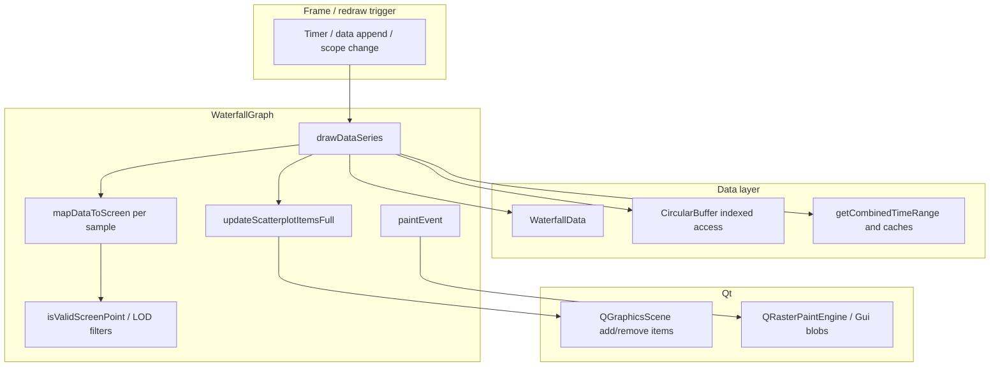

# Architecture note: Callgrind profile `callgrind.out.213944`

**Purpose:** Relate a concrete **Callgrind** run of `ui-sandbox` to the layered architecture described in [`ARCHITECTURE_AND_IMPLEMENTATION_METHODOLOGY.md`](./ARCHITECTURE_AND_IMPLEMENTATION_METHODOLOGY.md), and record **evidence-backed** performance implications. This is not a substitute for full system design docs; it supplements them with profiling facts.

**See also:** [`PERFORMANCE_ARCHITECTURE_DECISIONS.md`](./PERFORMANCE_ARCHITECTURE_DECISIONS.md) (prioritized remediation patterns), [`observations-for-future-redesigns.md`](./observations-for-future-redesigns.md) (profiling-backed redesign observations, including `callgrind.out.39553`).

---

## 1. Profile metadata

| Field | Value |
|--------|--------|
| File | `callgrind.out.213944` (repo root) |
| Tool | Valgrind Callgrind 3.22.0 |
| Binary | `./ui-sandbox` |
| PID | 213944 |
| Event | **Ir** (retired instructions; proxy for CPU cost, not wall time) |
| Total (shown summary) | **91,203,797,623** Ir |
| Trigger | Program termination |

**Interpretation:** Ir counts **CPU work done in-process**. It does not model GPU composition, Wayland server-side time, or blocked waits. Large Ir in **Qt shared libraries without debug symbols** appears as unnamed addresses; treat those rows as “Qt widget / scene / paint stack,” not as a precise function name.

---

## 2. Architectural mapping of hotspots

The codebase stack (orchestration → panel → graph → data) is summarized in the methodology doc. The profile heat concentrates in the **visualization + Qt scene** band and the **data accessor** band:

### 2.1 Layer: visualization (`WaterfallGraph` and subclasses)

| Approx. Ir share | Symbol / location | Architectural role |
|------------------|---------------------|---------------------|
| **~1.87%** | `WaterfallGraph::mapDataToScreen(double, long long) const` | Core **world → screen** transform; called heavily per sample / per overlay element. |
| **~0.42%** | `WaterfallGraph::drawDataSeries` | Per-series draw orchestration; fans out into mapping and geometry. |
| **~0.38%** | `WaterfallGraph::isValidScreenPoint` | Per-point validation on hot paths. |
| **~0.38%** | `WaterfallGraph::updateScatterplotItemsFull` | Scatter item maintenance; interacts with scene and buffers. |
| **~0.27%** | `WaterfallGraph::paintEvent` | QWidget paint entry; ties raster path to waterfall buffer / overlays. |

**Conclusion:** The dominant **application-named** cost is **per-coordinate mapping and point-path construction**, not a single “mystery” algorithm elsewhere.

### 2.2 Layer: data (`WaterfallData`, `CircularBuffer`)

| Approx. Ir share | Symbol / location | Architectural role |
|------------------|---------------------|---------------------|
| **~0.80%** | `CircularBuffer<QDateTime>::operator[]` | Hot indexed access into time series backing store. |
| **~0.35%** | `CircularBuffer<std::pair<float, long long>>::operator[]` | Epoch-backed or paired samples; inner-loop indexing. |
| **~0.40%** | `WaterfallData::getCombinedTimeRange` | Global range query; costly if invoked inside per-point or per-series loops. |

**Conclusion:** Data structures are **tight and indexed** on hot paths; remaining wins are **call-site frequency** (how often range is recomputed, how often buffers are walked) and **representation** (prefer epoch integers in inner loops where comparisons dominate).

### 2.3 Layer: Qt platform (widgets, graphics scene, painting)

| Approx. Ir share | Category | Architectural role |
|------------------|----------|---------------------|
| **~8.8%** (top blob) | `libQt5Widgets.so` (unnamed) | Event delivery, widget tree, graphics view scaffolding. |
| **~2.5% + 2.2%** (blobs) | `libQt5Gui.so` (unnamed) | Raster paint engine, paths, brushes—consistent with line/scatter/waterfall painting. |
| **~0.94%** | `QGraphicsScene::addItem` | Scene mutation cost when items are created/re-added frequently. |
| **~0.33%** | `QGraphicsScene::removeItem` | Paired teardown cost with churn patterns. |

**Conclusion:** A measurable fraction of total Ir is **scene item lifecycle** and **paint engine**. That aligns with “incremental graphics item management” and overlay symbol pools already present in parts of the code: **reuse and batch** beat **allocate/delete per frame** at this scale.

### 2.4 System libraries (memcpy, malloc, datetime)

| Approx. Ir share | Symbol | Architectural implication |
|------------------|--------|---------------------------|
| **~4.3%** | `__memcpy_avx_unaligned_erms` | Large contiguous copies—buffer resizes, image/pixmap paths, vector growth. |
| **~1.5%+** | `malloc` / `_int_malloc` / `free` | Allocation churn; often correlated with `QVector`/`std::vector` growth and temporary containers. |
| **~1.0%** | `QDateTime::operator<` | Many ordering comparisons; candidate to replace with **epoch ms** on inner filters. |
| **~0.4%** | `__offtime`, `getenv`, `vfscanf` | Environment / libc helpers—secondary; investigate only if perf mode enables verbose logging or config re-read. |

---

## 3. Hot-path mental model (from profile + code roles)

The following is a **logical** hot path consistent with the flat profile (not a single stack sample):



**Reading:** `drawDataSeries` and friends drive **tight loops** over `WaterfallData` → **`mapDataToScreen`** → validation → optional **scatter/scene** updates → **`paintEvent`** raster work.

---

## 4. Architecture decisions reinforced by this profile

These align with [`PERFORMANCE_ARCHITECTURE_DECISIONS.md`](./PERFORMANCE_ARCHITECTURE_DECISIONS.md); the callgrind file adds **quantitative weight** to several items:

1. **Incremental-first rendering** — Full redraws and wholesale scene clears inflate `addItem`/`removeItem`/malloc; keep promotion to full redraw rare and justified.
2. **Per-frame coalescing** — `getCombinedTimeRange` and similar queries should not run at per-point frequency inside the same draw pass.
3. **Epoch on inner loops** — High `QDateTime::operator<` Ir suggests comparing **qint64 epoch** where possible when scanning or bisecting series.
4. **Reuse graphics items** — Scene churn shows up directly; pool or update transforms on existing items where topology is stable.
5. **Pre-size containers** — `vector::push_back` / `QVector::append` + memcpy suggest reserving known capacities for visible-point batches.

---

## 5. How to reproduce and extend

```bash
cd /path/to/cpp_ui_lib
valgrind --tool=callgrind --callgrind-out-file=callgrind.out.<pid> ./ui-sandbox
# exercise UI, then exit
callgrind_annotate --auto=yes --threshold=99 callgrind.out.<pid> | less
```

For **caller chains**, open the same file in **KCachegrind** and navigate callers of `WaterfallGraph::mapDataToScreen` and `drawDataSeries`.

---

## 6. Document history

| Date | Change |
|------|--------|
| 2026-05-13 | Initial note from `callgrind.out.213944` flat annotation (`callgrind_annotate`, Ir totals). |
