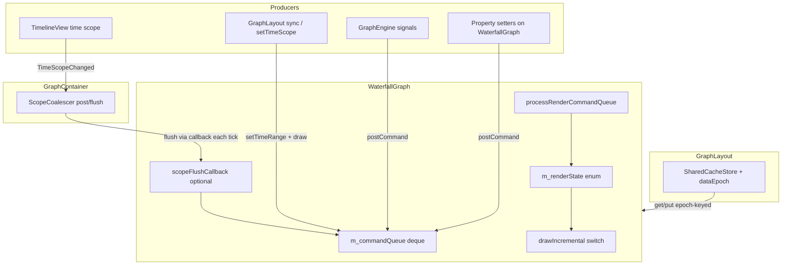

# WaterfallGraph render pipeline (post-migration)

This document describes the **typed command queue**, **frame scheduler**, **scope coalescing**, and **shared projection cache** introduced for real-time waterfall views. It complements [ARCHITECTURE_AND_IMPLEMENTATION_METHODOLOGY.md](ARCHITECTURE_AND_IMPLEMENTATION_METHODOLOGY.md).

---

## 1. Goals and constraints

- **Separation of concerns**: producers (data, timeline, properties) post **what** to do; a single path decides **how** to draw (incremental vs range-only vs full).
- **Coalescing**: many events in one frame collapse to one expensive path (full &gt; incremental &gt; range-only).
- **No silent full redraws**: every full redraw is logged with a **reason** string (`DEBUG_OUT`: `FULL_REDRAW reason: …`).
- **Unchanged by this work**: `GraphEngine`, `WaterfallData`, `CircularBuffer` (no edits there). **MainWindow-facing** `GraphContainer` / `GraphLayout` constructor signatures stay the same; wiring uses small additive hooks (e.g. `attachSharedCacheStore`).

---

## 2. Architecture overview



**High-level flow**

1. Code calls `WaterfallGraph::postCommand(RenderCommand)` (or setters that post internally).
2. A **16 ms** `QTimer` (`Qt::PreciseTimer`) runs `onFrameTick()`: merge queue → set `RenderState` → `drawIncremental()`.
3. **GraphContainer** feeds pending timeline scope via `setScopeFlushCallback` returning `std::optional<ScopeChange>` from `ScopeCoalescer::flush()` once per tick.
4. **Synchronous** paths call `draw()` or `drainRenderQueueSynchronously()`: run `processRenderCommandQueue()` then `drawIncremental()` if state is not `CLEAN`.

---

## 3. New and changed files

| File | Role |
|------|------|
| [rendercommands.h](../rendercommands.h) | `RenderPath`, command structs, `RenderCommand` = `std::variant<…>`, `maxRenderPath`, `overloaded` visitor helper |
| [scopecoalescer.h](../scopecoalescer.h) | `ScopeCoalescer`: `post(min,max)`, `flush()` → optional `ScopeChange` |
| [sharedcachestore.h](../sharedcachestore.h), [sharedcachestore.cpp](../sharedcachestore.cpp) | `CacheKey`, `CachedProjection`, LRU `SharedCacheStore`, `bumpDataEpoch()` |
| [waterfallgraph.h](../waterfallgraph.h), [waterfallgraph.cpp](../waterfallgraph.cpp) | Queue, scheduler, `applyScopeToModel`, shared-cache fill/publish hooks |
| [graphcontainer.h](../graphcontainer.h), [graphcontainer.cpp](../graphcontainer.cpp) | `ScopeCoalescer`, timeline wiring, `attachSharedCacheStore` |
| [graphlayout.h](../graphlayout.h), [graphlayout.cpp](../graphlayout.cpp) | Owns `SharedCacheStore`, attaches to containers, bumps epoch on bulk data ops |
| [timelineview.h](../timelineview.h), [timelineview.cpp](../timelineview.cpp) | `timeScopeCommitted` after slider release (final window) |
| [ui-sandbox.pro](../ui-sandbox.pro) | `CONFIG += c++17`; lists new sources/headers |

---

## 4. Command types and merge semantics

Commands live in `std::deque<RenderCommand>`. `processRenderCommandQueue()` drains the deque in one pass and computes a single **`RenderPath`**:

| Command | Effect on path (via `maxRenderPath`) | Notes |
|---------|----------------------------------------|--------|
| `DataAppend{series}` | ≥ **Incremental** | Also clears `dataRangesValid`, map cache; dirty series merged |
| `ScopeChange{min,max}` | **RangeOnly** or **Full** | Uses `scopeWithinRenderedExtent` vs `m_renderedTimeMin/Max`; may invalidate visible cache |
| `StyleChange{}` | **Full** | Grid, line mode, wholesale style / data replace |
| `ForceInvalidate{reason}` | **Full** | Reason logged; rendered extent reset |
| `YRangeChange{}` | **Incremental** | Y-axis / range recompute without full scene policy |
| `IncrementalRedrawAllSeries{}` | **Incremental** | All series marked dirty (symbols, markers) |

**Path cost order** (for `maxRenderPath`): `None` &lt; `RangeOnly` &lt; `Incremental` &lt; `Full`.

After merging, the code maps `RenderPath` to legacy **`RenderState`** (`CLEAN`, `RANGE_UPDATE_ONLY`, `INCREMENTAL_UPDATE`, `FULL_REDRAW`) and calls the existing **`drawIncremental()`** switch (no separate `drawFull` / `drawRangeOnly` functions yet—the behavior is unchanged inside that switch).

---

## 5. Rendered extent and RangeOnly

- **`m_renderedTimeMin` / `m_renderedTimeMax`** are updated at the end of the **full** redraw branch inside `drawIncremental()` (same as before).
- **`scopeWithinRenderedExtent(ScopeChange)`** returns true only if the new window lies inside the last fully rendered time window.
- **`applyScopeToModel`** updates `timeMin`, `timeMax`, custom time fields, and screen/time caches—**without** choosing render path (the queue does that).
- **`setTimeRange`** applies the model immediately **and** posts `ScopeChange` so the scheduler picks RangeOnly vs Full.

---

## 6. Scope coalescing (timeline drag)

- **`GraphContainer::onTimeScopeChanged`** calls `m_scopeCoalescer.post(start,end)` only (no per-event `setTimeRange` + `draw` storm).
- **`WaterfallGraph::setScopeFlushCallback`** on the **current** graph returns `m_scopeCoalescer.flush()` once per `processRenderCommandQueue()` (invoked from `onFrameTick`).
- **`TimelineView` / `TimelineVisualizerWidget`**: after drag ends, emits **`timeScopeCommitted`** so the container can `flush()` → `postCommand(ScopeChange)` → `drainRenderQueueSynchronously()` and commit the final window without waiting another frame.

Non-current graphs clear the flush callback so only one graph consumes the coalescer.

---

## 7. Shared cache store (`SharedCacheStore`)

- **Owner**: `GraphLayout` holds `m_sharedRenderCache` and calls `GraphContainer::attachSharedCacheStore(&m_sharedRenderCache)` when wiring containers.
- **Key**: `GraphType`, visible scope (`timeMin`/`timeMax` as epoch ms), and **`dataEpoch`**.
- **Epoch**: `GraphLayout::bumpDataEpoch()` on `addDataPointToDataSource`, `addDataPointsToDataSource`, and `setDataToDataSource` invalidates all entries in one step (instead of N per-panel cache clears).
- **Use in `WaterfallGraph`**: `tryFillVisibleCacheFromSharedStore` before rebuilding visible data; `publishVisibleCacheToSharedStore` after `updateVisibleDataCacheFull`. Per-graph geometry, selection, and overlay state stay local.

---

## 8. Removed / replaced patterns

| Old | New |
|-----|-----|
| `scheduleRedraw` / `m_redrawPending` / queued `drawIncremental` | `postCommand` + frame timer + `draw()` / `drainRenderQueueSynchronously` |
| Direct `setTimeRange` + `draw()` on every timeline scope signal | Coalescer `post` + tick flush + commit on `timeScopeCommitted` |
| `forceFullRedraw()` with no reason | `forceFullRedraw(const QString &reason)` defaulting to `"unspecified"`; posts `ForceInvalidate` |

**Still present**: `m_rangeUpdateNeeded` and `markRangeUpdateNeeded()` for Y-range and BTW symbol tail logic until a later pass maps them entirely to commands.

---

## 9. Coding patterns (for contributors)

### 9.1 Posting work (preferred)

```cpp
graph->postCommand(DataAppend{seriesLabel});
// Rely on timer, or for immediate UI:
graph->drainRenderQueueSynchronously();
```

### 9.2 Full redraw with reason

```cpp
graph->forceFullRedraw(QStringLiteral("my_feature_reason"));
```

Always pass a **stable, searchable** reason for non-default redraws (helps grep and debug logs).

### 9.3 Timeline / scope

- Do not call `setTimeRange` on every high-frequency scope event from the timeline if you bypass `GraphContainer`; use the same coalescer pattern or post `ScopeChange` yourself.

### 9.4 New command type

1. Add a `struct` in [rendercommands.h](../rendercommands.h).
2. Append it to `RenderCommand` variant.
3. Extend `std::visit(overloaded{…})` in `WaterfallGraph::processRenderCommandQueue()`.
4. Choose how it combines with `maxRenderPath`.

### 9.5 Subclasses (`BDWGraph`, `BTWGraph`, …)

Overrides of `draw()` should end up calling **`WaterfallGraph::draw()`** (or the same process + `drawIncremental` path) so the scheduler is not bypassed.

---

## 10. Build requirement

The project uses **C++17** (`std::variant`, `std::visit`, structured bindings where used). See `CONFIG += c++17` in [ui-sandbox.pro](../ui-sandbox.pro).

---

## 11. Metrics and validation

The migration plan calls for **callgrind** (or equivalent) before and after: count **full redraws** and **repaints** for fixed simulator scenarios (single- and multi-panel). Attach those numbers to PR descriptions when you change this pipeline.

---

## 12. Quick reference: who calls what

| Caller | Typical commands / behavior |
|--------|------------------------------|
| `GraphEngine` (signals) | `DataAppend`, `YRangeChange`, `IncrementalRedrawAllSeries` |
| `GraphContainer` timeline | `ScopeCoalescer::post`; flush via graph callback + `TimeScopeCommitted` |
| `GraphContainer::setTimeScope` | `setTimeRange` (model + `ScopeChange`) + `draw()` |
| `GraphLayout` data APIs | `bumpDataEpoch` + existing container notifications |
| Property setters | `StyleChange`, `YRangeChange`, `drainRenderQueueSynchronously` where UX needs instant feedback |

This document reflects the implementation in the repository at the time of writing; if you extend the pipeline, update the tables and diagrams here in the same PR.
