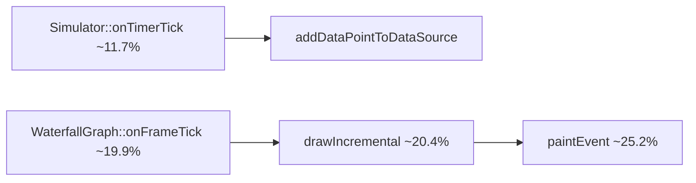

# Observations for future redesigns

**Purpose:** Capture **evidence-backed** performance and architecture observations from Callgrind profiles and related code-path analysis. Use this when planning refactors, not as a substitute for [`ARCHITECTURE_AND_IMPLEMENTATION_METHODOLOGY.md`](./ARCHITECTURE_AND_IMPLEMENTATION_METHODOLOGY.md) or [`PERFORMANCE_ARCHITECTURE_DECISIONS.md`](./PERFORMANCE_ARCHITECTURE_DECISIONS.md).

**Sources:**

| Profile | File | Total Ir | Session character |
|---------|------|----------|-------------------|
| Baseline | [`callgrind.out.213944`](./ARCHITECTURE_CALLGRIND_PROFILE_213944.md) | ~91.2B | General UI / tick / draw workload |
| Marker interaction | `callgrind.out.39553` (repo root) | ~83.1B | Baseline plus BTW manual-marker drag/rotate |

**Interpretation:** Ir counts **in-process CPU work**, not wall time, GPU composition, or blocked waits. Unnamed rows in `libQt5Gui.so` / `libQt5Widgets.so` should be read as “Qt paint / scene / widget stack,” not precise function names.

---

## 1. Steady-state rendering (both profiles)

The dominant application-named cost is **per-coordinate mapping and geometry construction**, not a single hidden algorithm.

### Visualization layer (`WaterfallGraph` and subclasses)

| Approx. Ir share (self) | Symbol | Observation |
|-------------------------|--------|---------------|
| **~1.14–1.87%** | `WaterfallGraph::mapDataToScreen(double, long long)` | Called heavily per sample and per overlay element; central hot function. |
| **~0.25–0.42%** | `WaterfallGraph::drawDataSeries` | Fans out into mapping, validation, scatter/scene updates (**~11% inclusive** in 39553). |
| **~0.23–0.38%** | `WaterfallGraph::updateScatterplotItemsFull` | Scatter item maintenance; interacts with scene churn. |
| **~0.23–0.38%** | `WaterfallGraph::isValidScreenPoint` | Per-point validation on inner loops. |
| **~0.27–0.56%** | `WaterfallGraph::paintEvent` | Paint entry; **~25% inclusive** in 39553 via `drawIncremental` / `onFrameTick`. |

**Redesign implication:** Wins come from **reducing call frequency** into `mapDataToScreen` and batching geometry, not from micro-optimizing the transform alone.

### Data layer (`WaterfallData`, `CircularBuffer`)

| Approx. Ir share (self) | Symbol | Observation |
|-------------------------|--------|---------------|
| **~0.63–0.80%** | `CircularBuffer<QDateTime>::operator[]` | Tight indexed access; structure is appropriate. |
| **~0.21–0.35%** | `CircularBuffer<pair<float, long long>>::operator[]` | Epoch-backed sample access on draw paths. |
| **~0.25–0.40%** | `WaterfallData::getCombinedTimeRange` | Expensive if invoked at per-point frequency inside a draw pass. |

**Redesign implication:** Keep buffers as-is; fix **call-site frequency** and prefer **epoch ms** over `QDateTime` comparisons in inner loops (`QDateTime::operator<` ~**0.62–1.0%** self in both profiles).

### Qt platform and system libraries

| Approx. Ir share (self) | Category | Observation |
|-------------------------|----------|---------------|
| **~5–13% combined** | `libQt5Gui.so` unnamed blobs | Raster paint engine, paths, strokes (`QRasterPaintEngine::stroke` ~1.1%). |
| **~0.65–8.8%** | `libQt5Widgets.so` unnamed blobs | Event delivery, graphics view scaffolding. |
| **~0.56–0.94%** | `QGraphicsScene::addItem` | Scene mutation when items are created/re-added frequently. |
| **~0.20–0.33%** | `QGraphicsScene::removeItem` | Paired cost with allocate/delete churn patterns. |
| **~4.3–6.1%** | `__memcpy_avx_unaligned_erms` | Buffer resizes, pixmap paths, vector growth. |
| **~1.2–1.5%+** | `malloc` / `_int_malloc` / `free` | Correlates with scene item and container churn. |
| **~0.73%** | `QVector<QPointF>::append` + `vector<QPointF>::push_back` (~**1.1%** combined in 39553) | Visible-point batches grow without pre-sizing. |

**Redesign implication:** **Reuse and batch** beat allocate/delete per frame. Pool graphics items where topology is stable (bearing-rate box already does this; blue circle markers do not).

### Frame pipeline (39553 inclusive view)



Normal ticking and painting dominate total CPU. Interactive overlay work must not piggyback on this path at mouse-move frequency.

---

## 2. BTW manual-marker interaction (`callgrind.out.39553`)

Profile 39553 includes significant **manual-marker drag/rotate** workload. This session exposes a separate cost band (~**6% inclusive Ir**) on top of steady-state rendering.

### Observed call chain (pre-fix)

```
InteractiveGraphicsItem::itemRotated / itemMoved
  → BTWInteractiveOverlay::onMarkerRotated / onMarkerMoved
    → updateBearingRateBox              (cheap, local)
    → markerDataChanged                 (cross-container sync)
  → BTWGraph::onMarkerRotated           (formerly: emit manualMarkerPlaced)
    → GraphLayout::onBTWManualMarkerPlaced
      → addBTWSymbolToAllGraphs
        → redrawGraph / redrawAllGraphs
          → forceFullRedraw → drainRenderQueueSynchronously
            → BTWGraph::draw → drawCustomCircleMarkers
```

### Quantitative evidence

| Inclusive Ir share | Path | Approx. calls |
|--------------------|------|---------------|
| **~2.86%** (~2.38B) | `manualMarkerPlaced` → `onBTWManualMarkerPlaced` | signal chain |
| **~2.99%** (~2.49B) | `GraphLayout::addBTWSymbolToAllGraphs` | **658×** |
| **~2.29%** (~1.90B) | `BTWGraph::onMarkerMoved` | drag events |
| **~2.43%** (~2.02B) | `BTWGraph::drawCustomCircleMarkers` | **2,643×** |
| **~4.73%** (~3.93B) | `BTWGraph::draw()` total | many redraws |
| **~0.37%** (~309M) | `GraphLayout::redrawAllGraphs` | **11×** |

### What is *not* hot

| Function | Self Ir | Notes |
|----------|---------|-------|
| `updateBearingRateBox` | ~0.003% | Bearing-rate math and label update are negligible. |
| `getCachedTextPixmap` | ~0.04% inclusive | Text pixmap cache is effective. |
| `syncMarkersWithTimeline` | ~0.002% | Cheap repositioning during zoom/range changes. |

**Observation:** Rotation hang was caused by **signal routing and synchronous full redraw**, not bearing-rate calculation.

### Fix applied (2026-05-20)

1. **`BTWGraph::onMarkerRotated`** — no longer emits `manualMarkerPlaced` (rotation does not change timestamp/position; magenta symbols do not depend on bearing angle).
2. **`GraphLayout::addBTWSymbolToAllGraphs`** — skips `redrawAllGraphs()` and `BTWSymbolAddedToAllGraphs` when no new symbol was added.

**Expected impact:** ~**2–3%** Ir reduction in marker-interaction sessions; wall-clock improvement likely larger because `drainRenderQueueSynchronously()` blocks the UI thread.

---

## 3. Observations for future redesigns

Prioritized by evidence strength and architectural leverage. Aligns with [`PERFORMANCE_ARCHITECTURE_DECISIONS.md`](./PERFORMANCE_ARCHITECTURE_DECISIONS.md).

### 3.1 Separate interaction signals from placement signals

**Observation:** `manualMarkerPlaced` was wired to “add magenta circles + redraw all graphs,” but was emitted on **rotation** and **every mouse-move during drag**.

**Redesign direction:**

- **Placement** (click, API): emit once → sync symbols across graphs.
- **Drag/rotate** (live): update overlay locally + optional debounced sync via `markerDataChanged`.
- **Commit** (mouse release): emit placement/sync side effects if timestamp or range changed.

Treat high-frequency pointer events as **overlay-local** unless a cross-graph data mutation is required.

### 3.2 Never call synchronous full redraw from pointer-move handlers

**Observation:** `redrawAllGraphs()` → `forceFullRedraw()` → `drainRenderQueueSynchronously()` ran from marker events stacked on the normal **~20% inclusive** `drawIncremental` / `paintEvent` pipeline.

**Redesign direction:**

- Full redraw remains an **exception path** with an explicit reason (see performance doc §1).
- Pointer handlers should post incremental overlay updates or coalesce redraw requests to the frame timer.
- If cross-graph symbol sync is needed, batch to **mouse release** or a **debounce window** (e.g. 16–32 ms).

### 3.3 Reuse blue circle marker graphics items

**Observation:** `drawCustomCircleMarkers` ran **2,643×** in profile 39553. Each pass scans the overlay scene, removes blue marker items by z-value/color heuristics, and allocates new `QGraphicsEllipseItem` / line / text items.

**Redesign direction:** Mirror `BTWInteractiveOverlay::updateBearingRateBox` — maintain a map from marker identity to existing items; update geometry/transform instead of delete/recreate. Would directly reduce `addItem` / `removeItem` / malloc Ir.

### 3.4 Debounce or gate `onMarkerMoved` → `manualMarkerPlaced`

**Observation:** `onMarkerMoved` contributed **~2.29% inclusive** Ir via the same global symbol/redraw chain as rotation (still present after the rotation fix).

**Redesign direction:** Emit `manualMarkerPlaced` only when the marker **commits** a new timestamp/range (mouse release), or when deduplication proves the symbol set actually changed.

### 3.5 Coalesce range and time queries per draw pass

**Observation:** `getCombinedTimeRange` appears at **~0.25–0.40%** self Ir; cost is call-site frequency, not the query itself.

**Redesign direction:** Compute visible time range **once per `drawIncremental` pass** and thread through series/overlay draws.

### 3.6 Epoch integers on inner loops

**Observation:** `QDateTime::operator<` at **~0.62–1.0%** self Ir; `__offtime` / timezone reads appear in hot paths when epoch conversion is repeated.

**Redesign direction:** Store and compare `qint64` epoch ms in bisect, filter, and LOD loops; convert to `QDateTime` only at API boundaries (overlay sync already partially does this in `syncMarkersWithTimeline`).

### 3.7 Pre-size point batches

**Observation:** `QVector<QPointF>::append` and `vector<QPointF>::push_back` together ~**1.1%** self Ir in 39553, plus **~6%** memcpy.

**Redesign direction:** Reserve from visible-window point count or LOD step before building path batches.

### 3.8 Instrument full-redraw triggers in perf mode

**Observation:** Multiple code paths can reach `forceFullRedraw` / `redrawAllGraphs`; profile 39553 shows **11×** `redrawAllGraphs` and **61×** `forceFullRedraw` without per-reason breakdown in Callgrind.

**Redesign direction:** Add debug/perf counters: `fullRedraw.count.byReason`, `incrementalUpdate.count`, `fullRedraw.ms.total` (already recommended in performance doc §1).

---

## 4. Comparison: baseline vs marker-interaction profile

| Metric | 213944 (baseline) | 39553 (marker session) |
|--------|-------------------|-------------------------|
| Total Ir | ~91.2B | ~83.1B |
| `mapDataToScreen` self | ~1.87% | 1.14% |
| `QGraphicsScene::addItem` self | ~0.94% | 0.56% |
| Marker pipeline inclusive | not highlighted | **~6%** |
| Top cost band | tick + draw + map | same + **manualMarkerPlaced chain** |

Profile 39553 is best read as **213944 plus a marker-interaction stress test**. Baseline conclusions still hold; the marker signal/redraw coupling is an additional architectural defect exposed by interaction.

---

## 5. How to reproduce and extend

```bash
cd /path/to/cpp_ui_lib
valgrind --tool=callgrind --callgrind-out-file=callgrind.out.<pid> ./ui-sandbox
# exercise UI: tick data, place/drag/rotate BTW marker, then exit
callgrind_annotate --auto=yes --threshold=99 callgrind.out.<pid> | less
callgrind_annotate --inclusive=yes --auto=yes callgrind.out.<pid> | \
  grep -E "manualMarker|addBTWSymbol|drawCustomCircle|mapDataToScreen|drawIncremental"
```

For caller chains, open the file in **KCachegrind** and navigate from `WaterfallGraph::paintEvent`, `BTWGraph::draw`, and `GraphLayout::addBTWSymbolToAllGraphs`.

After the 2026-05-20 rotation fix, re-profile the same marker-interaction scenario and compare inclusive Ir on `manualMarkerPlaced` and `addBTWSymbolToAllGraphs` call counts.

---

## 6. Document history

| Date | Change |
|------|--------|
| 2026-05-20 | Initial observations from `callgrind.out.213944` (via existing architecture note) and `callgrind.out.39553` (marker drag/rotate analysis). Includes BTW rotation hang root cause, applied fix, and prioritized redesign items. |
